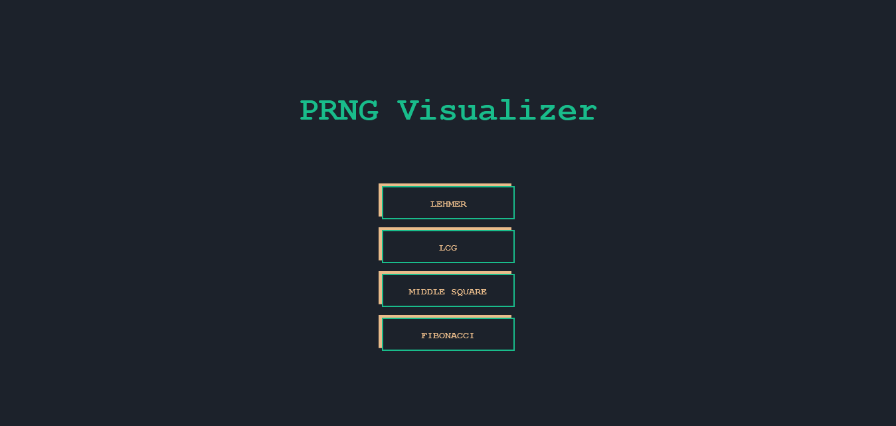

## Pseudorandom number generator visualizer

###### Visualize various Pseudorandom number generators!

Select the method you want to visualize:

Play with the values, click "Draw" and see the magic!

Click the name to go back to homepage and play with another one!

## Live version

Check out the live version [here](https://prngvisualizer.netlify.app/)

## Contributing 🖇️

Any contributions are highly appreciated. There are two things you can do:

1. Create an issue explaining your idea.
2. Fork the project and submit a Pull Request with your idea already developed explaining it in detail.

⌨️ with ❤️ by [Ukliz](https://github.com/Uklizdev) 😊
